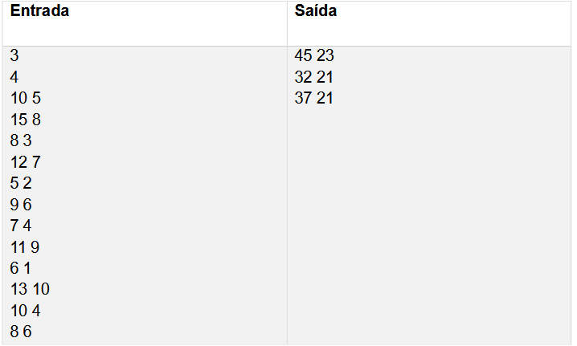
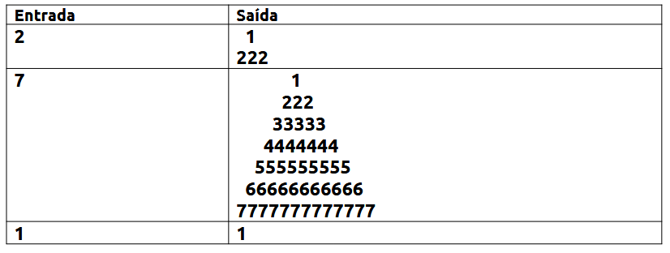

# Apostilas

Esse repositório é dedicado às apostilas da Renova. Para esse repositório, eu decidi usar a linguagem Python.

A apostila 1 consiste de 26 exercícios.

A apostila 2 consiste de 10 exercícios.

# Índice

1. **[Exercícios](#Exercícios)**
    1. [Apostila 1](#apostila-1)
        1. [Exercício 1 - Exame Chunin](#exame-chunin)
        2. [Exercício 2 - Continha](#continha)
        3. [Exercício 3 - Desenhista](#desenhista)
         4. [Exercício 4 - Incursão da Divisão de Reconhecimento](#incursão-da-divisão-de-reconhecimento)
        5. [Exercício 5 - Drone da Amazônia](#drone-da-amazônia)
        6. [Exercício 6 - Média Ponderada](#média-ponderada)
        7. [Exercício 7 - Contador de Segundos](#contador-de-segundos)
        8. [Exercício 8 - Escolha do Campeão](#escolha-do-campeão)
        9. [Exercício 9 - Contabilizando Pokémons](#contabilizando-pokémons)
        10. [Exercício 10 - Fazendo um gol](#fazendo-um-gol)
        11. [Exercício 11 - Super Mario Bros](#super-mario-bros)
        12. [Exercício 12 - As Novas Missões Jedi](#as-novas-missões-jedi)
        13. [Exercício 13 - Bolinhas de Gude](#bolinhas-de-gude)
        14. [Exercício 14 - Altura](#altura)
        15. [Exercício 15 - Cai pro x1](#cai-pro-x1)
        16. [Exercício 16 - Ajude o pequeno Kurumin](#ajude-o-pequeno-kurumin)
        17. [Exercício 17 - Clones das Sombras](#clones-das-sombras)
        18. [Exercício 18 - Entregas do Lobo Mau](#entregas-do-lobo-mau)
        19. [Exercício 19 - Forjando Espadas](#forjando-espadas)
        20. [Exercício 20 - Ajude Skywalker](#ajude-skywalker)
        21. [Exercício 21 - Energia de Aceleração](#energia-de-aceleração)
        22. [Exercício 22 - Pentatlo](#pentatlo)
        23. [Exercício 23 - Desafio Tático](#desafio-tático)
        24. [Exercício 24 - Intervalos](#intervalos)
        25. [Exercício 25 - Pirâmide de limonadas](#pirâmide-de-limonadas)
        26. [Exercício 26 - Fortalecimento de clima](#fortalecimento-de-clima)

# Exercícios
***

# Apostila 1

## Exame Chunin
A Aldeia da Folha deu início ao Exame Chunin! Nele, dezenas de ninjas dividiram-se em trios para disputar dois pergaminhos. Cada equipe iniciará a etapa do exame com um pergaminho, precisando lutar para conquistar outro pergaminho, mas precisa ser um de cada tipo para que possam se classificar para a segunda fase. Baseado nisso, seu programa deverá avisar se o trio de Naruto Uzumaki, Sasuke Uchiha e Sakura Haruno foram classificados ou eliminados do Exame Chunin.

### Entrada
A entrada é composta por dois caracteres “P1” e “P2”, dados em linhas diferentes e representando a característica de cada pergaminho. Portanto, “P1” e “P2” podem ser “A” (azul), “B” (branco) e “N” (sem pergaminho).

### Saída
A saída será composta pela mensagem “classificado”, indicando que o trio foi classificado (dois pergaminhos distintos) ou “eliminado” (pergaminhos iguais ou pelo menos um pergaminho faltando), indicando a eliminação da equipe.

### Exemplos

| **Entrada** | **Saída**    |
|-------------|--------------|
| A  B         | classificado |
| B  B         | eliminado    |
| A  N         | eliminado    |
***
## Continha

O semestre já começou e as aulas já estão ai. Você que não é bobo(a), nem nada, decidiu treinar programação com os melhores professores da UFBA. E para mostrar seus conhecimentos,
foi requisitado que você faça um programa para resolver a expressão matemática, dada por **((A + B) * (C - D) * (E + F)) / 2** e mostre para todos que você é fera nas continhas.

### Entrada

A entrada contém 6 valores inteiros: **A, B, C, D, E, F (0 <= A, B, C, D, E, F <= 100)**

### Saída

Imprima a mensagem “Eu sou FERA nas continhas e o resultado é ”, sem as aspas, em seguida o resultado da expressão, que é um número real com uma casa decimal de precisão

### Exemplos 

| **Entrada** | **Saída** |
|:------------|:----------|
|7  3  15  30  0  2| Eu sou FERA nas continhas e o resultado é -150.0|
|1  2  10  5  2  2| Eu sou FERA nas continhas e o resultado é 30.0|
***
## Desenhista 

Mário cansou de pular em cogumelos, tubulações e realizar saltos em pirâmides. A idade chegou e agora ele está aposentado, e no seu tempo livre, ele adora desenhar. Dessa vez ele está praticando desenhar  pirâmides, lembrando dos velhos tempos. Ajude-o imprimindo os blocos dessa pirâmide.

### Entrada 

A entrada consiste em um número inteiro ‘P’ (1 <= P <= 20), que representa a altura que a pirâmide terá.

### Saída

Na saída você deverá imprimir a pirâmide com o caractere ‘#’, conforme a quantidade de linhas solicitadas, e nos locais vagos, usar o caracter ‘>’, como no exemplo abaixo.

### Exemplos 

| **Entrada** | **Saída** |
|:------------|:----------|
|7            |>>>>>># >>>>>## >>>>### >>>#### >>##### >###### #######|
***
## Incursão da Divisão de Reconhecimento

A Divisão de Reconhecimento se prepara para mais uma incursão além das muralhas em uma região de interesse infestada de titãs. Como em toda boa incursão, a preparação é algo vital para o sucesso e controle de eventuais baixas. Para isso o comandante Erwin Smith te incumbiu do processo de alocação de tropas, considerando a quantidade de inimigos na região e o tempo máximo de exposição das tropas.

Sabendo que o tempo máximo de exposição das tropas nessa missão é de 1 hora e que Levi Ackerman também foi alocado para a incursão, implemente um programa que dado um número inteiro X de titãs, faz uma alocação de um número inteiro Y de tropas que deverão acompanhar Levi.

**Considere as seguintes estatísticas:**
(Levi Ackerman -> Mata 20 titãs por hora)
(Soldado comum -> Mata 5 titãs por hora)

### Entrada

A entrada possui **um único número inteiro ‘N’ (20 ≤ N ≤ 200)**, que representa a **quantidade de titãs na região**, e **será sempre um múltiplo de 5**.

### Saída

A saída consiste em um **número inteiro X** que representa **a quantidade de soldados comuns necessários para eliminar <u>todos</u> os titãs durante 1 hora de missão**

### Exemplos

| **Entrada** | **Saída** |
|:------------|:----------|
|100| 16|
|30|2|
|20|0|
***
## Drone da Amazônia

A loja virtual e mundialmente famosa Amazônia decidiu fazer suas
entregas utilizando drones. Porém, ainda é necessário implementar a parte do código que irá dizer ao drone se ele está na coordenada determinada para a entrega ou não. Você deve escrever um programa que dadas as coordenadas para a entrega e as coordenadas atuais do drone, diga se o drone pode ou não soltar o pacote.

### Entrada

A primeira linha da entrada consiste de dois inteiros, **X1** e **Y1**, que correspondem às coordenadas para a entrega. A segunda linha consiste de dois inteiros, **X2** e **Y2**, correspondentes às coordenadas atuais do drone. Saiba que **1 <= X1, Y1, X2, Y2 <= 1000**.

### Saída 

Seu programa deve imprimir em uma única linha "**Soltar pacote**" (sem aspas), caso as coordenadas da entrega e do drone sejam iguais, ou "**Nao soltar pacote**" (sem aspas e sem til), caso as coordenadas sejam diferentes.

### Exemplos

| **Entrada** | **Saída** |
|:------------|:----------|
|5 20 5 20|Soltar pacote|
|3 4 2 4| Nao soltar pacote|
***
## Média Ponderada

Em uma disciplina da UFBA, as notas dos alunos são compostas por 3 avaliações: duas provas online com peso 4 e um trabalho final com peso 2. Sabendo disso, escreva um programa que leia as notas dos alunos e calcule a média ponderada das notas.

### Entrada

A entrada contém uma linha com três números decimais, representando as notas das duas provas e do trabalho final, respectivamente.

### Saída 

Imprima a média ponderada das notas do aluno **com duas casas decimais** após a vírgula.

### Exemplos

| **Entrada** | **Saída** |
|:-----------|:-----------|
|8.0 7.5 9.0|8.00|
|6.5 6.0 6.5|6.30|
|5.0 10.0 8.0|7.60|
***
## Contador de segundos

Senku é um garoto muito inteligente e gosta de contar o tempo em segundos. As vezes, quando precisa contar um tempo muito longo, ele pode se perder e errar a conta. Senku quer saber se contou o tempo de um determinado evento em segundos corretamente, para isso ele precisa que você converta o tempo em segundos, que ele calculou, para horas, minutos e segundos.

### Entrada

Será dado um número inteiro **N (1 <= N <= 100000000)** que representa o tempo do evento em segundos.

### Saída

Contém o tempo dado em segundos convertido para horas, minutos e segundos, como nos exemplos abaixo.

### Exemplos

| **Entrada** | **Saída** |
|:------------|:----------|
|4000|1h 6m 40s|
|5200|1h 26m 40s|
|59|0h 0m 59s|

***
## Escolha do Campeão

League of Legends está cheio de campeões de vários tipos, de mentes malignas a monstros épicos. Diferentes campeões assumem diferentes papéis e usam diferentes estratégias. Lucas sempre joga LOL e gosta de variar na sua escolha de campeão, **dessa vez ele quer jogar com o campeão de maior nível de poder** dentre os que ele mais gosta.

**Dado um número ‘N’, que representa a quantidade de campeões favoritos de Lucas, ajude ele a decidir qual deles tem o maior nível.**

### Entrada

A entrada consiste na primeira linha de um número inteiro **'N' (1 < N < 100)** que representa **o número de campeões favoritos de Lucas**. Nas próximas **'N'** linhas será fornecido em cada uma, um número inteiro **'P' (0 <= P <= 10000)** que representa **o nível de poder de cada um dos 'N' campeões.**

### Saída

A saída deverá **conter apenas o nível de poder do campeão mais forte**.

### Exemplos 

| **Entrada** | **Saída** |
|:------------|:----------|
|3  1500  3600  500|3600|
|7  300  5200  540  729  3567  480  4000|5200|

***
## Contabilizando Pokémons

A Pokédex, também conhecida como Poké-
Agenda, é uma enciclopédia virtual portátil de alta tecnologia que os treinadores Pokémon transportam para registrar todas as espécies diferentes de Pokémon que são encontradas durante a sua viagem como treinadores.

O novo modelo de Pokédex está sendo
desenvolvido e registra monstrinhos das regiões de Kanto, Johto e Hoenn. Sempre que Pokémons de uma nova espécie são capturados, a Pokédex deve adicionar a quantidade de Pokémons capturados ao contador das regiões em que eles são originários. Sua missão é desenvolver um programa que implemente essa funcionalidade

### Entrada

A entrada é composta de 2 linhas. A primeira linha contém três inteiros que representam o número de pokémons já registrados na Pokédex de cada região, na ordem 'K' (Kanto), 'J' (Johto) e 'H' (Hoenn). A segunda linha contém o número de novos pokémons capturados de cada região na mesma ordem da primeira linha. 

> Restrições:
>> (0 <= K,J,H <= 100)

### Saída

Imprima, na ordem da entrada (K J H), o número total de pokémons de cada região após a nova contagem, separados por espaço. Imprima uma quebra de linha no fim.

### Exemplos

| **Entrada** | **Saída** |
|:------------|:----------|
|92 40 54  1 0 0| 93 40 54 |
|12 1 0  0 2 2 | 12 3 2    |

***
## Fazendo um gol

O jogo favorito de Lucas é Bomba Patch. Atualmente, ele está desenvolvendo uma forma de saber qual é o melhor lado para driblar o zagueiro adversário e chutar para o gol. Por isso ele pediu sua ajuda para desenvolver um programa que vai receber as direções que o zagueiro e o goleiro tentarão defender, e as direções que o atacante irá tentar driblar o zagueiro e chutar para gol, e diga se o atacante terá sucesso ou não.

### Entrada 

A entrada é composta por apenas duas linhas contendo dois caracteres em cada. Na primeira linha temos "z" e "g", sendo "z" a direção que o zagueiro irá para tentar bloquear o drible do atacante e "g" a direção que o goleiro irá tentar defender o chute do atacante. A segunda linha contém dois caracteres "d" e "c", que são respectivamente, a direção que o atacante irá tentar driblar o zagueiro, e se passar pelo zagueiro, a direção que o atacante irá chutar para o gol. Saiba que os valores possíveis para “z”, ”g”, “d” e “c” são esquerda ou direita, representados pelos caracteres ‘e’ e ‘d’, respectivamente.

### Saída

A saída depende das seguintes situações: 1) no caso do zagueiro e atacante irem na mesma direção, só haverá uma linha na saída e ve-se imprimir a frase "Bloqueado"; 2) no caso de zagueiro e atacante irem em direções opostas, a frase impressa na primeira linha será "Driblado"; 3) caso o atacante tenha passado pelo zagueiro e o atacante chute na mesma direção que o goleiro foi para tentar defender, a frase impressa na segunda linha será "...e o goleiro pega"; 4) caso o atacante chute para um lado e goleiro vá para o outro a frase na segunda linha será "Gol".

Obs.: **Só há a segunda linha na saída se o atacante passar pelo zagueiro. Sempre
interprete os dados na perspectiva dos próprios jogadores, ou seja, para qual lado cada um vai.**

### Exemplos

| **Entrada** | **Saída** |
|:------------|:----------|
|e e   e d      | Driblado ...e o goleiro pega|
|d d  d d      | Driblado Gol|
|e d  d d      | Bloqueado |

***
## Super Mario Bros

No New Super Mario Bros você entra no Mushroom Kingdom, e persegue o Bowser Jr. e a princesa Peach que foi raptada! Você precisa explorar oito mundos para encontrar todas as 240 Star Coins. Para isto, é preciso pôr em prática as tuas habilidades e usar ajudas adicionais como o Mega Mushroom, a Carapaça Koopa Azul e o Mini Mushroom para que nada fique por descobrir. **Em um determinado mundo, sabe-se que temos 3 áreas secretas, onde é possível encontrar em cada uma, 10 Star Coins, 2 Mega Mushrooms e 1 Carapaça Koopa Azul. Para ir ao próximo mundo você deve encontrar todas as Star Coins deste mundo**.

### Entrada 

Considerando as três áreas secretas, a entrada **consiste nos itens que você conseguiu encontrar**, sendo três números inteiros **'SC' (0 <= SC <= 30), 'MM' (0 <= MM <= 6)** e **'CK' (0 <= CK <= 3)** representando, respectivamente, **Star Coins, Mega Mushrooms e Carapaças Koopa Azul**.

### Saída 

A saída consiste em uma única linha. Caso você não tenha encontrado todas as Star Coins, **deve ser impresso a quantidade de itens ainda por serem descobertos no mundo atual, sendo impresso primeiro a quantidade de Star Coins, seguido pela quantidade de Mega Mushrooms e por fim, a quantidade de Carapaças Koopa Azul**. Caso você tenha conseguido encontrar todas as Star Coins você deve imprimir a mensagem "**PROXIMO MUNDO**".

### Exemplos

| **Entrada** | **Saída** |
|:------------|:----------|
|30 1 2       |PROXIMO MUNDO|
|3 1 0        |27 5 3     |
|10 4 0       |20 2 3     |

***
## As Novas Missões Jedi

Há muito tempo atrás em uma galáxia muito muito distante, por mais de mil gerações, os Cavaleiros Jedi foram os guardiões da paz e da justiça na Velha República. A Ordem Jedi era uma ordem hierárquica indo desde Jedi Iniciado, Jedi Padawan, até o Grande Mestre, sendo Yoda um exemplo.

Para permitir um bom aprendizado dos poderes, várias missões eram realizadas, **aumentando o XP do Jedi em ‘X’ pontos caso este cumprisse a missão**. Assim, várias missões serão atribuídas aos Jedi e você foi escolhido para ajudar. Lembre-se que a força está com você, Padawan.

### Entrada

Seu programa receberá primeiramente um inteiro **'N' (1 ≤ 'N' ≤ 100)** e um inteiro **'XP' (1 ≤ 'XP' ≤ 100)**, que representam respectivamente, a quantidade de missões a serem realizadas igualmente por Yoda, Luke e Ahsoka, seguido da quantidade de XP que estes ganharão ao completar cada missão. Na linha seguinte serão dados **3 inteiros** que representam os respectivos níveis iniciais de XP **'XPi' (1 <= 'XPi' <= 1500)** de Yoda, Luke e Ahsoka.

### Saída 

**Para cada** Jedi, **Yoda, Luke e Ahsoka**, nessa ordem, você **deverá imprimir uma linha com seu nome e seu novo 'XP'**, separados por espaço. Portanto, assuma que eles já cumpriram todas as novas missões ao imprimir seus dados

### Exemplos

| **Entrada** | **Saída** |
|:------------|:----------|
|3 50   1500 800 1000|Yoda 1650 Luke 950 Ahsoka 1150|
|5 1   5 2 4|Yoda 10 Luke 7 Ahsoka 9|

*** 
## Bolinhas de Gude

O natal está chegando e Yuri já deixou avisado a seus familiares que gostaria de receber bolinhas de gude como presente este ano. Yuri sabe que seus familiares têm um hábito peculiar quando o assunto é presentear com bolinhas de gude, pois sempre que um familiar lhe presenteia com uma quantidade de bolinhas de gude o próximo familiar presenteia com o dobro do anterior. Como Yuri sabe que você é um ótimo programador, ele pediu para que você desenvolva um programa que dada a quantidade de familiares que irá presenteá-lo com bolinhas de gude e a quantidade de bolinhas de gude que o primeiro familiar lhe dará, informe a quantidade total de bolinhas de gude que ele irá receber de presente de natal.

### Entrada

A entrada é composta por um número inteiro **N (1 ≤ N ≤ 50)**, que representa a quantidade de familiares que irão presenteá-lo com bolinhas de gude e um inteiro **Q (1 ≤ N ≤ 50)**, que representa a quantidade de bolinhas que o primeiro familiar dará de presente.

### Saída

A saída consiste em imprimir a quantidade total de bolinhas de gude que Yuri irá receber.

### Exemplos 

| **Entrada** | **Saída** |
|:------------|:----------|
|10 2         |2046       |
|5 15         |465        |

***
## Altura

Três amigos estavam discutindo para saber quem era o mais alto, mas como um não queria ouvir o outro, eles não conseguiram chegar a um consenso, e por isso pediram que você escrevesse um programa que dissesse qual a altura do maior dos três amigos, dado a altura de cada um deles.

### Entrada

A entrada é composta por três números inteiros diferentes, A, B e C, a altura de cada um dos amigos (em centímetros) respectivamente, separados por um espaço em branco.

### Saída

Você deve imprimir em uma única linha a altura do maior dos três amigos.

### Limites

- 100 ≤ A ≤ 200
- 100 ≤ B ≤ 200
- 100 ≤ C ≤ 200

### Exemplos

| **Entrada** | **Saída** |
|:------------|:----------|
|100 150 140  |150        |
|100 137 140  |140        |
|122 111 103  |122        |

***

## Cai pro x1

Lucas está jogando x1 contra seu amigo Pedro no counter strike, porém ele está com dificuldade em saber quem obteve a maior pontuação geral de abates. Considerando que eles jogaram 3 partidas, sua tarefa é elaborar um programa que dada a pontuação de Pedro e Lucas em cada uma das 3 partidas diga quem obteve o maior número de abates total.

### Entrada 

A entrada consiste em 3 linhas contendo 2 inteiros **'L', 'P' (1 <= 'L', 'P' <= 100)** em cada uma, sendo que **L** indica a pontuação de Lucas e **P** a pontuação de Pedro.

### Saída

A saída consiste em uma linha contendo a palavra “Empate”, caso os dois empatem, o nome “Pedro” caso Pedro tenha obtido uma pontuação de abates total maior que a de Lucas, ou o nome “Lucas”, caso Lucas tenha abates total maior que Pedro.

### Exemplos

| **Entrada** | **Saída** |
|:------------|:----------|
|20 32   16 50   100 0|Lucas  |
|20 32   14 54   10 0|Pedro   |
|16 0  0 8   4 12|Empate|

***

## Ajude o pequeno Kurumin

Na aldeia do pequeno Kurumin eles prezam muito pelo intelecto de cada um da tribo. Por isso, desde cedo os índios passam por testes de iniciação de inteligência.

Hoje é o dia do primeiro teste do pequeno Kurumin. Nesse teste **ele é colocado no meio de 'N' gaiolas** de bambu, uma estando dentro da outra. **Em cada gaiola, em cada um de seus lados há um número, A, B, C e D**. Para sair de cada gaiola, **Kurumin deve somar os 4 números em seus lados (A + B + C + D) e se o resultado for maior ou igual a 100, Kurumin deve refazer o cálculo para esta gaiola, subtraindo os valores dos lados (A – B – C – D) em vez de somar**.

Se Kurumin não conseguir resolver todos os cálculos, a tribo deixará ele preso para sempre nas gaiolas. Por isso, ajude-o para que ele possa sair o mais rápido possível.

### Entrada

Na primeira linha há um inteiro **'N' (1 <= N <= 20)** que representa **a quantidade de gaiolas**. Em cada uma das próximas **'N'** linhas serão dados 4 inteiros **'A', 'B', 'C', 'D' (-20 <= A, B, C, D <= 50)**, representando **os números nos lados de cada gaiola**.

### Saída

No final do teste, Kurumin deverá informar **a soma 'S' de todos os resultados de cada gaiola**. Segundo o curandeiro da tribo, isso representará a quantidade de anos que Kurumin viverá entre eles. Portanto, imprima somente a frase "**S anos de vida**"

### Exemplos

| **Entrada** | **Saída** |
|:------------|:----------|
|3   15 13 12 10   04 16 -14 03   40 -13 40 41| 31 anos de vida|
|2   50 -20 35 -12   15 19 -10 -16| 61 anos de vida|

###### Obs: No primeiro exemplo, a primeira gaiola tem soma 50, a segunda tem soma 09 e a terceira tem soma 108. No caso da terceira gaiola, como a soma é maior ou igual a 100, então precisa refazer o cálculo dessa gaiola, subtraindo os valores dos lados dessa gaiola, ou seja, 40 - (-13) – 40 – 41, resultando -28. Portanto, o valor total será 50 + 09 – 28 para as três gaiolas, resultando em 31 anos de vida para Kurumin

***

## Clones das Sombras

Em outro dia comum na aldeia da folha, nosso querido naruto estava tranquilo comendo seu lámen quando foi surpreendido pela tentativa de invasão de dezenas de ninjas da aldeia da areia.
Para enfrentar tantos inimigos, a melhor arma do naruto é o jutsu clone das sombras. 

Porém, o lámen não caiu muito bem e naruto não está com sua força total. **Então, ele só consegue fazer um clone por vez, e cada clone também só consegue invocar mais um único clone**, ou seja, **a quantidade de narutos só pode ser dobrada a cada jutsu.**

A sua tarefa é fazer um programa que seja capaz de dizer **se será possível ter um número de narutos que seja exatamente igual ao número de inimigos.**

### Entrada 

A primeira linha da entrada consiste de um inteiro **'N' (1 <= N <= 5000)**, que representa **a quantidade de ninjas inimigos.**

### Saída

A saída consiste em uma linha contendo "**Dattebayo**", **caso seja possível ter o número de narutos exatamente igual ao número de inimigos**, ou "**Tururuuu**", **caso não seja possível.**

### Exemplos

| **Entrada** | **Saída** |
|:------------|:----------|
|32           |Dattebayo  |
|50           |Tururuuu   |
|16           |Dattebayo  |
|3            |Tururuuu   |
|4            |Dattebayo  |
|1            |Dattebayo  |

***

## Entregas do Lobo Mau

O Lobo Mau resolveu parar um pouco com as maldades, decidiu abrir uma empresa de entregas e convidou Chapeuzinho Vermelho para ser sua sócia.

Certo dia, Chapeuzinho precisou levar doces e bolos para sua vovozinha. Como todos sabem, ela mora longe, o caminho é deserto e o Coelho Mau mora ali por perto. Sim, como o Lobo virou empresário, alguém tinha que tomar seu lugar na floresta. Para passar pelo caminho da floresta, o Coelho passou a cobrar um valor **'V'** por km e um valor **'P'** por pedágio. Assim, Chapeuzinho pediu uma carona ao seu sócio e lá foi ela pela estrada a fora, já não tão sozinha, levar os bolos e doces para a vovozinha.

Saiba que a estrada tem tamanho **'T'**, que os pedágios estão a uma distância **'D'** um dos outros (**igualmente espaçados**) e que **o primeiro pedágio está no km 'D'**. Portanto, o começo da estrada não possui um pedágio, mas o seu final pode estar logo após um pedágio (**por exemplo, se a distância entre dois pedágios consecutivos for de 20 km e a estrada tiver 60 km, Chapeuzinho deve pagar um pedágio aos 20 km, aos 40 km e aos 60 km**). Assim, calcule quanto custará para a pobre Chapeuzinho passar pela floresta e levar os doces para a vovozinha.

### Entrada

A entrada é composta na primeira linha por 2 inteiros, **'T' e 'D' (1 <= 'T','D' <= 1000)**, representando o tamanho da estrada e a distância entre os pedágios. Na próxima linha serão fornecidos outros 2 inteiros, **'V' e 'P' (1 <= 'V', 'P' <= 100)**, representando o valor por km de estrada e o valor por cada pedágio.

### Saída

Na saída será apresentado o valor total pela travessia da floresta.

### Exemplos

| **Entrada** | **Saída** |
|:------------|:----------|
|
60 20   1 10
|90         |
|100 51 
 2 50|250       |

***

## Forjando Espadas

Winterfell está a todo vaporna preparação para a iminente guerra contra os White Walkers! Gendry, um exímio ferreiro, está trabalhando dia e noite para forjar os equipamentos necessários para as batalhas. Neste momento, ele foi encarregado de preparar a maior quantidade de espadas possível. Gendry dispõe de quase todos os materiais necessários sem se preocupar, devendo ser cauteloso apenas com a quantidade referente às lâminas, cabos e bainhas. Como a quantidade de guerreiros é imensa, o ferreiro não pode se dar ao luxo de desperdiçar esses materiais, portanto seguirá a proporção exata de Aço Valiriano, Madeira e Couro. Para cada espada forjada, Gendry utiliza 2 fragmentos de aço valiriano, 3 pedaços de madeira e 5 tiras de couro.

Gendry tem uma certa dificuldade em realizar algumas contas de matemática simples e pediu a sua ajuda para auxiliá-lo a calcular a quantidade máxima de espadas que podem ser fabricadas a partir de uma dada quantidade de fragmentos de aço valiriano, pedaços de madeira e tiras de couro.

### Entrada

A entrada consiste de três números inteiros: **A**,**M**,**C**, que representam respectivamente aquantidade de fragmentos de aço valiriano, pedaços de madeira e tiras de couro.
**(1 ≤ A, M, C ≤ 100)**

### Saída

Seu programa deverá imprimir a quantidade máxima de espadas que Gendry poderá forjar.

### Exemplos

| **Entrada** | **Saída** |
|:------------|:----------|
|4 6 10       |2          |
|2 100 40     |1          |

***

## Ajude Skywalker

Há muito tempo atrás, em uma galáxia muito muito distante, Skywalker era um dos mais conhecidos e poderosos Jedi. Ele era conhecido pela sua famosa habilidade de pilotar. Em uma das inúmeras batalhas que participou ele pediu a ajuda do(a) mais habilidoso(a) programador(a) da galáxia, você. Ajude Skywalker a vencer esta batalha e que a força esteja com vocês.

Sua tarefa é: sabendo que a nave de Skywalker está equipada com um dróide capaz de sondar todo o quadrante, diga quantas naves inimigas há.

### Entrada 

A entrada é composta por cinco inteiros, 'A', 'B', 'C', 'D' e 'E', representando respectivamente, o total de naves sondadas no quadrante, o total de naves amigas detectadas a frente de Skywalker, o total de naves amigas a direita, o total de naves amigas a esquerda e o total de naves amigas atrás da nave de Skywalker. **Saiba que 0 <= A, B, C, D, E <= 1000 e que (B + C + D + E) <= A**.

### Saída

A saída será composta por apenas um número inteiro, ou seja, o total de naves inimigas no quadrante em que Skywalker se encontra.

### Exemplos

| **Entrada** | **Saída** |
|:------------|:----------|
|100 10 20 30 30|10       |
|55 1 2 3 4   |45         |

***

## Energia de Aceleração

A teoria da relatividade explica a relação entre a velocidade, a matéria e o tempo: quanto mais próximo da velocidade da luz um objeto se move, mais devagar o tempo passa para ele; e quanto mais rápido um objeto se move (e quanto mais pesado ele é), mais energia é necessária para acelerá-lo ainda mais (Energia = Massa x Velocidade²). Graças a essas limitações, é praticamente impossível viajar na velocidade da luz. Barry Allen, o Flash, o homem mais rápido do mundo, conseguiu essa façanha graças a *Força de Aceleração*, não só eliminando o obstáculo de produção da energia necessária, como também, em diversas ocasiões, o permitindo ultrapassar a velocidade da luz (299 792 458 m/s).

Escreva um código que, dado o peso atual do Flash e a velocidade em que ele está correndo, retorne a quantidade de energia que ele teria que produzir para chegar a essa velocidade caso não utilizasse a força de aceleração.

### Entrada 

A entrada consiste em dois valores inteiros positivos correspondentes à massa (o peso) atual do Flash em quilos (**40 ≤ P ≤ 100**) e a velocidade em que o Flash está correndo em determinado momento, em metros por segundo (**0 ≤ V ≤ 300.000.000**).

### Saída 

A saída corresponde a um inteiro que é a energia necessária para o Flash chegar a essa velocidade considerando as limitações descritas pela teoria da relatividade (Energia = Massa x Velocidade²).

### Exemplos 

| **Entrada** | **Saída** |
|:------------|:----------|
|80 100       |800000     |
|65 0         |0          |

***

## Pentatlo

O pentatlo moderno é uma modalidade Olímpica tradicional, composta por 5 das modalidades mais antigas existentes na história do esporte. Os seus competidores precisam se mostrar excelentes na pratica de modalidades que exigem habilidades incomuns, podendo assim ser campeões individualmente ou como uma equipe, trazendo medalhas para o seu país. Dentre as habilidades necessárias, o competidor deve se provar um bom atirador, tendo sangue frio e boa mira, um bom esgrimista, tendo uma boa audição, reflexos rápidos e apurados, ser um bom corredor, com as passadas rápidas do deus Hermes, além de nadar bem rápido, como um golfinho, e ser bom de montaria no hipismo.

Considerando que cada atleta recebe uma nota para o desempenho dele em cada modalidade separadamente, vence aquele que tiver uma média aritmética maior, após serem somadas as 5 notas do processo. 

O Comitê Olímpico Brasileiro envia em todas as edições dos jogos dois atletas que disputam esta modalidade em busca da glória eterna. Neste momento, eles precisam de sua ajuda para montar um programa que rapidamente possa computar as notas dos atletas durante a classificatória e gerar uma média final a ser usada como padrão de classificação do torneio.

### Entrada

Serão dados em uma única linha o número inteiro **'X'** de inscrição do candidato **(1 <= X <= 1000)**, seguido de mais 5 notas inteiras **N1, N2, N3, N4 e N5 (0 <= N1, N2, N3, N4, N5 <= 10)**, relativas ao Tiro ao alvo, Natação, Esgrima, Hipismo e Corrida.

### Saída

A saída deve imprimir o número de inscrição do atleta seguido de sua média final com uma casa decimal de precisão.

### Exemplos

| **Entrada** | **Saída** |
|:------------|:----------|
|123 5 10 5 10 10|123 8.0 |
|230 8 8 7 7 9|230 7.8    |

***

## Desafio Tático

Em um jogo de estratégia, os jogadores possuem um exército de soldados numerados de 1 a N. Cada soldado possui um valor de ataque e um valor de defesa. Durante uma batalha, os jogadores podem escolher uma formação de soldados para enfrentar o exército inimigo.

Escreva um programa que, dado o número de jogadores, a quantidade de soldados que cada jogador possui e as informações de ataque e defesa dos soldados, calcule a soma dos valores de ataque e defesa para cada jogador.

### Entrada

Um número inteiro **'P'**, representando o número de jogadores.

Um número inteiro **'S'**, representando a quantidade de soldados que cada jogador possui.

**'P'** blocos de **'S'** linhas cada, onde cada linha contém dois números inteiros separados por espaço. O primeiro número representa o valor de ataque e o segundo número representa o valor de defesa de um soldado. Os valores de ataque e defesa estão na faixa de 1 a 100.

### Saída 

'N' linhas com dois números inteiros separados por espaço, representando a soma dos valores de ataque e defesa para cada jogador.

### Exemplos

***

## Intervalos

Em matemática, podemos representar conjuntos, subconjuntos e soluções de equações pela notação de intervalo. Intervalo significa que o conjunto possui cada número real entre dois extremos indicados, seja numericamente ou geometricamente. Não é possível representar subconjuntos ou conjuntos que não sejam reais (ou contidos nos reais) pela notação de intervalo. Para este problema, considere apenas intervalos de números inteiros.

Dizemos que um intervalo é aberto quando seus extremos não estão incluídos, por exemplo, o intervalo ]3,8[ representa o conjunto: {4,5,6,7}. Um intervalo fechado é aquele em que seus extremos são incluídos, por exemplo, o intervalo [3,8] representa o conjunto: {3,4,5,6,7,8}. Por fim, dizemos que um intervalo é semiaberto ou semifechado quando um de seus extremos são incluídos, por exemplo, o intervalo ]3,8] representa o conjunto: {4,5,6,7,8}.

Considerando dois intervalos semiabertos ou semifechados, sendo o primeiro sempre no formato ]x,y] (assuma x < y) e o segundo sempre no formato [w,z[ (assuma w < z), faça um programa que, dado dois intervalos de inteiros e dado um número inteiro, informe em qual ou quais intervalos o número está, ou se não está em nenhum dos dois intervalos.

### Entrada 

A entrada contém três linhas: a primeira corresponde ao primeiro intervalo (]x,y]); a segunda corresponde ao segundo intervalo ([w,z[); e a terceira corresponde ao número inteiro que se quer descobrir o intervalo ao qual pertence.

### Saída 

A saída deve ser conforme exemplos abaixo: 

### Exemplos

***

## Pirâmide de limonadas

Sanji é um cozinheiro dedicado, que sempre busca atender os desejos da sua tripulação e hoje ele decidiu fazer algo diferente. Sanji decidiu organizar taças de limonada em uma pilha em forma de pirâmide, onde a altura é de **'N'** níveis e cada nível da pirâmide terá **'J * 2 -1' (1 <= J <= N)** taças, sendo **'J'** o nível na pirâmide, sendo **o topo como 1 e a base como 'N'**. Note que as taças de cada nível devem ser representadas pelo número (algarismo numérico) que indica seu nível **'J'** na pirâmide, ou seja, as taças da base são representadas pelo algarismo **'N'** e a taça do topo pelo algarismo **'1'**. Vamos ajudar Sanji a impressionar seus companheiros?

### Entrada

A entrada possui um número inteiro **'N' (1 <= N <= 9)** representando o número de níveis da pilha piramidal.

### Saída

A saída consiste em **'N'** linhas que representam os níveis da pirâmide **em ordem crescente**, ou seja, **nível com mais taças por último**. Cada nível **começa com 'N – J'** espaços em branco, seguidos pelos **'J * 2 - 1' algarismos** que **representam as taças** daquela fileira.

### Exemplos

## Fortalecimento de clima

As habilidades principais dos Pokémon recebem um acréscimo de pontos de dano quando o clima está favorável. Cada pokémon está limitado a um valor de acréscimo.

Seu trabalho será desenvolver um programa que, dado o limite de acréscimo de um pokémon e o valor atual de pontos de dano da sua habilidade principal, informe com quanto de pontos de dano ele vai ficar.

### Entrada

A primeira linha da entrada contém um valor **'N' (1 <= N <= 1000)** que representa o número de pokémon que serão fortalecidos pelo clima. Já cada uma das próximas **'N'** linhas contém o valor **'P' (1 <= P <= 1000)** de pontos de dano do ataque principal de um pokémon e o seu valor **'M' (0 <= M <= 1000)** de acréscimo.

### Saída

A saída é composta de 'N' linhas, cada uma representando o valor final de pontos de dano de cada linha da entrada.

### Exemplos

| **Entrada** | **Saída** |
|:------------|:----------|
|3   105 20 122 22 140 50|125 144 190|
|2   200 2 105 0|202 105|

***

# Apostila 2

## Campo de Abóboras

Hagrid está tendo um dia cheio com Bicuço e pediu ajuda a Harry e Ron. Eles precisam ajudá-lo a coletar abóboras. **A plantação é grande e para acelerar o trabalho, Hagrid pede que Harry fique responsável pela colheita em uma determinada linha, começando na esquerda e indo até o fim dela na direita. Da mesma forma, Hagrid pede que Ron colha as abóboras em outra linha, porém agora, Ron começa em cima e vai até o fim dela na parte de baixo da plantação**.

Hagrid quer saber ao fim da tarefa qual dos dois coletou mais abóboras, levando-se em consideração seu peso. **Só tome cuidado com o ponto de intersecção entre as duas linhas que Harry e Ron irão coletar as abóboras. Somente um deles fica com a abóbora que está lá, ela é do primeiro que lá chegar, ou seja, ela pertence àquele que estiver mais próximo dela a partir do ponto de início de sua colheita, e se der empate na distância, a abóbora fica com Ron**.

### Entrada 

Seu programa receberá primeiramente um inteiro **'N' (1 ≤ 'N' ≤ 100)**, representando o tamanho da plantação de abóboras, que é um campo de proporção NxN (N linhas horizontais por N linhas verticais). A seguir serão dadas **'N'** linhas, onde em cada uma serão dados **'N'** inteiros **'P' (1 <= P <= 100)**, que representam o peso de cada abóbora no campo. Há uma abóbora em cada posição do campo NxN. Por fim, a última linha da entrada contêm as linhas **'X'** e **'Y' (0 <= X,Y < N)** que Harry e Ron irão coletar, respectivamente. **Cuidado que a linha de Ron na verdade se trata de uma coluna na matriz da plantação**.

### Saída 

Imprima o peso total da colheita de Harry e a seguir, na linha de baixo, imprima o peso total da colheita de Ron, como nos exemplos abaixo.

### Exemplos

| **Entrada** | **Saída** |
|:------------|:----------|
|4 1 2 3 4 5 6 7 8 1 3 5 7 2 4 6 8 1 2|Harry 19 Ron 21           |
|4 1 2 3 4 5 6 7 8 1 3 5 7 2 4 6 8 2 1|Harry 16 Ron 12           |
|3  1 2 3  4 5 6 7 8 9 1 1|Harry 10 Ron 15         |